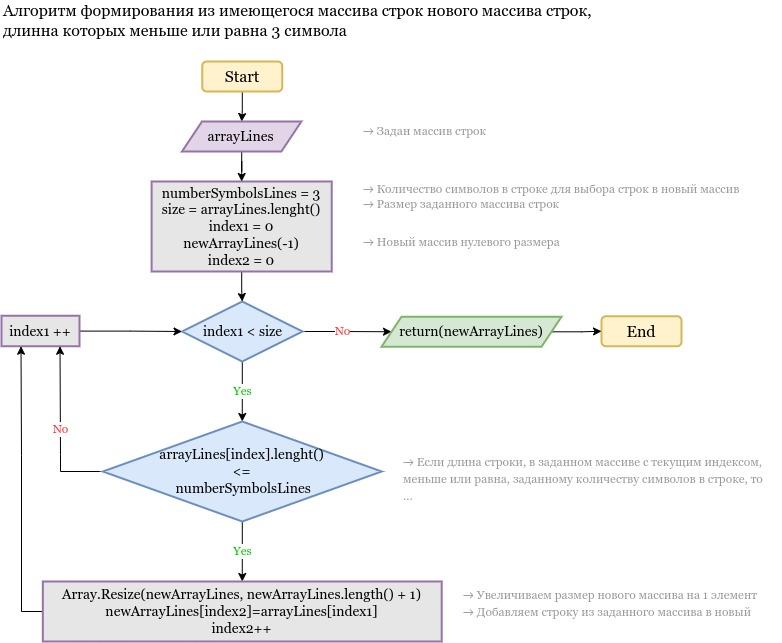

# GB_FinalworkFirstQuarter
_In this repositorie is final work of the first block of  the learning programm the "Programmer" in GeekBrains_

## Задача 

Написать программу, которая из имеющегося массива строк формирует массив из строк, длина которых меньше либо равна 3 символа. Первоначальный массив можно ввести с клавиатуры, либо задать на старте выполнения алгоритма. При решении не рекомендуется пользоваться коллекциями, лучше обойтись исключительно массивами.

## Алгоритм решения 

## Описание программы 

На старте программы осуществляется ввод первоначального одномерного массива строк*:

* Для ввода строки используйте клавиатуру.

* Для ввода следующей строки нажмите клавишу:

    Spacebar

* Для завершения ввода нажмите клавишу **:

    Escape

По окончанию ввода первоначального массива, программа реализует алгоритм, представленный выше и выводит на экран исходный массив и массив, заполненный строками из исходного массива, длина которых меньше или равна 3 символа.
___
_Примечания:_ 

_* Строка - последовательный набор символов._ 

_** Для корректного вывода одномерного массива при вводе строк рекомендуется не нажимать клавишу Enter. В следующем релизе программы данная клавиша может быть использована для перехода на новую строку при заполнение двумерного массива._

